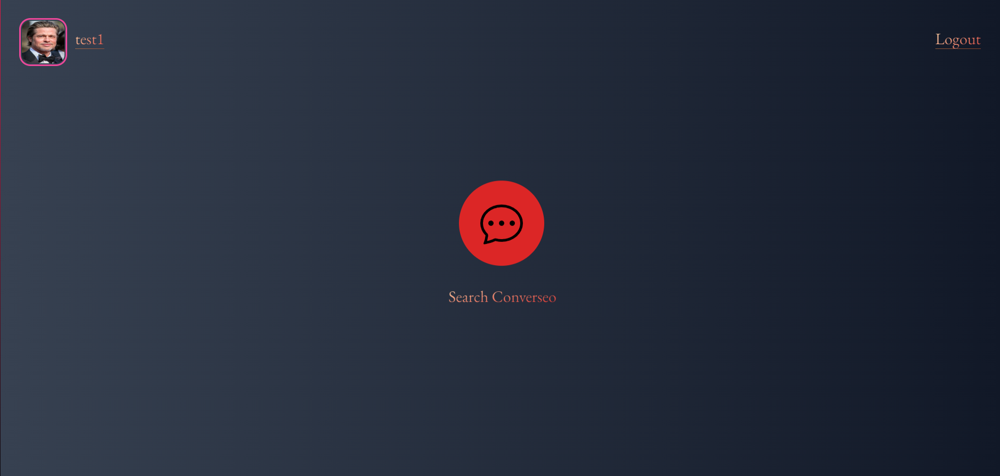
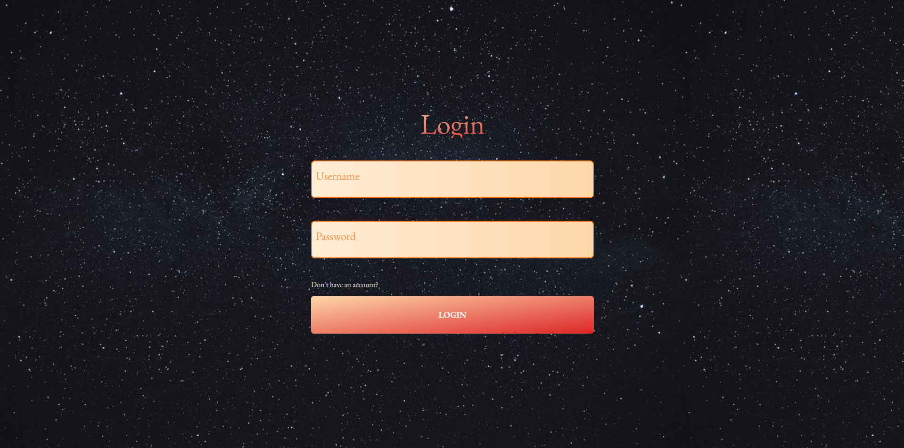
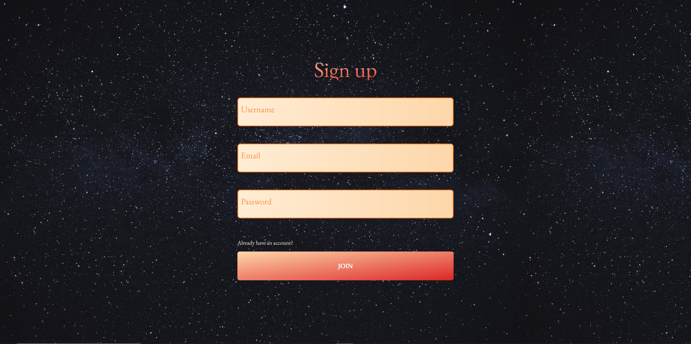
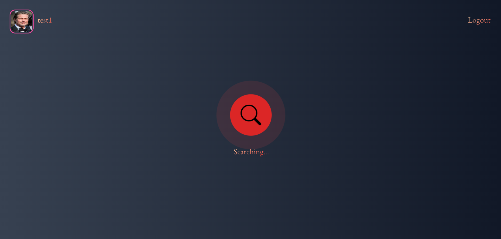
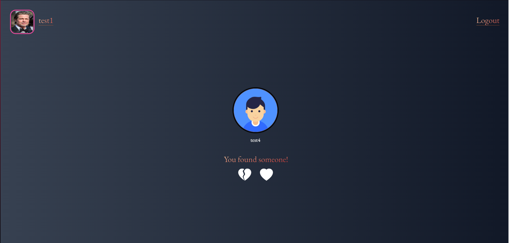
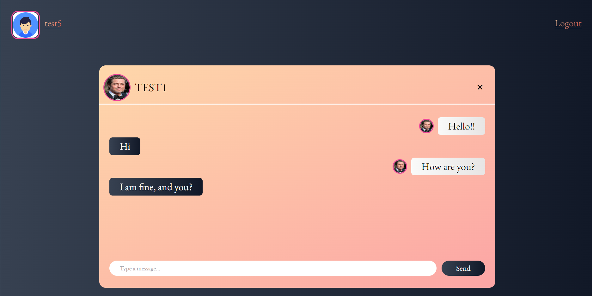
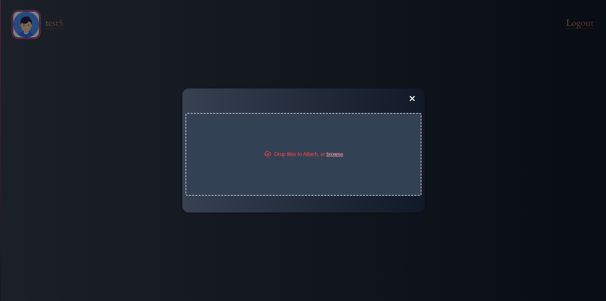
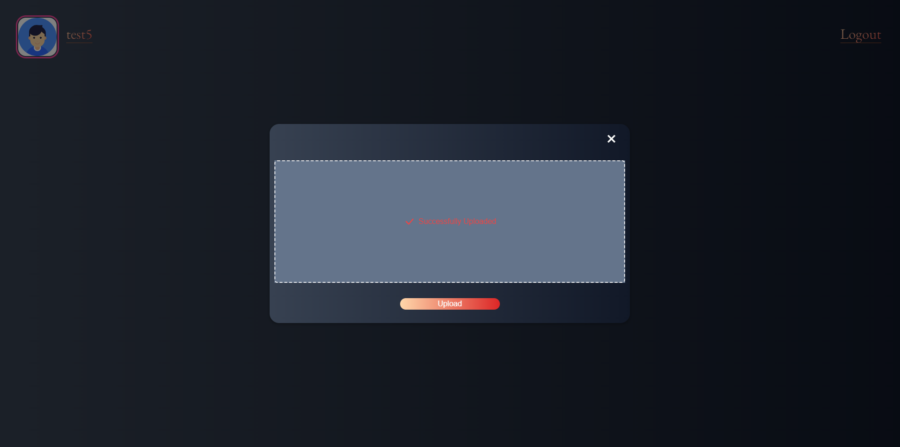

# Converseo

  

> <h2>Converseo is an web app allowing the users to communicate with each other and look for new acquaintances.Backend was made in Django Rest Framework (asgi,channels included) as an API for Frontend which contains Vite/Vue app, managing websocket connections and API Calls (axios).
</h2>  

Live demo  
• [Converseo](http://3.127.135.129)  

Dummy user credentials  
<b>Username</b>: 'test1'  
<b>Password</b>: 'test1'

<b>Username</b>: 'test4'  
<b>Password</b>: 'test4'

## Table of Contents
* [General Info](#general-information)
* [Technologies Used](#technologies-used)
* [Features](#features)
* [Screenshots](#screenshots)
* [Setup](#setup)
* [Project Status](#project-status)
* [Improvements to be done](#improvements-to-be-done)
* [Contact](#contact)
<!-- * [License](#license) -->

## General Information
Converseo is an web app allowing the users to communicate with each other and look for new acquaintances.  
It allows you to search for people to talk with you.
Firstly you have to register a profile inside Converseo and set your avatar to better expose yourself to the potential Talkers.
Then you are ready to go, click at the icon which allows you to search for them.

Clicking at it, adds the profile to the queue of searching users and if there are someone who also is looking for new chatter, they get a match.
Each of them has to vote if they want to talk, they have two options - decline or accept.
If both of them accept, they are redirected to the conversation room, where they can talk.

In case someone gets bored or does not want to talk anymore, there is a close conversation button.

## Technologies Used
-  Python 3.10.4 &nbsp;
-  Django 4.1.5 &nbsp;
-  Django Rest Framework 3.14.0 (w/ channels, simplejwt)&nbsp;
-  Daphne Django ASGI&nbsp;
-  HTML5&nbsp;
-  SASS&nbsp;
-  Tailwind&nbsp;
-  JavaScript ES6+ (websockets included)&nbsp;
-  Vite&nbsp;
-  Vue&nbsp;
-  Axios&nbsp;

### :hammer_and_wrench: Tools & Deployment:
-  PyCharm&nbsp;
-  MySQL&nbsp;
-  AWS EC2/S3 (static files storage, VPS server)&nbsp;
-  Nginx&nbsp;
-  Docker&nbsp;
-  Redis&nbsp;

## Features
List the ready features here:
- Creating an account
- Logging in
- Adding/editing avatar image
- Searching for talkers
- Deciding if you want to talk to a random person
- Conversation room for matched talkers and sending messages
- Closing the conversation

## Screenshots

<!-- If you have screenshots you'd like to share, include them here. -->
... and many more!

## Setup
1. Create New Folder  

2. Type  
> 'git clone https://github.com/drutkoowski/Converseo.git' into the console/git cli  
Then  
> 'cd Converseo'  

3. Create Virtual Environment by typing  
>'python3 -m venv venv' (in some cases you might use python instead of python3)  

4. Install all required dependencies located in requirements.txt using  
> 'pip install -r requirements.txt'  

5. Create '.env' file (variables required are located in env-sample) 

6. Run migrations by typing  
> 'python manage.py makemigrations' and then 'python manage.py migrate'  

7. Install packages
> 'cd frontend' and then 'npm install'

8. Run frontend server
> 'npm run dev'

9. Finally run backend server  
> 'python manage.py runserver'  

Frontend server: http://localhost:5173
Backend server: http://localhost:8000

Or using Docker:
1. Pull the project from Github
> 'git clone https://github.com/drutkoowski/Converseo.git'
2. Navigate to project folder
> 'cd Converseo'
3. Create Docker Image
> 'docker compose -f local.yml up -d'

## Project Status
Project is: :fire: COMPLETED :fire:

## Improvements to be done
- Adjusting layout
- Adding some better UX

## Contact
Created by Damian Rutkowski - feel free to contact me!

  
  
   
  
  
  

